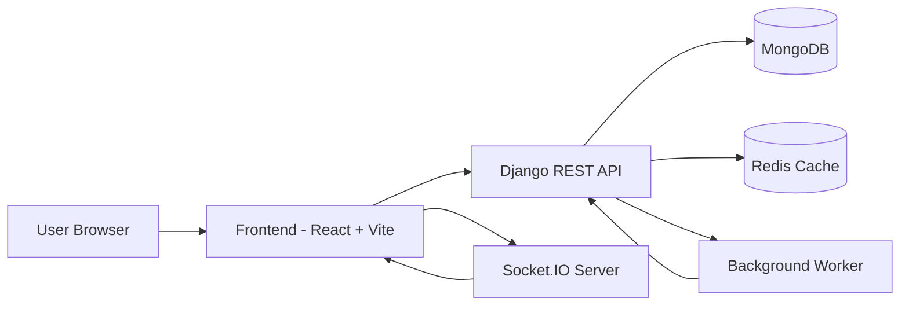
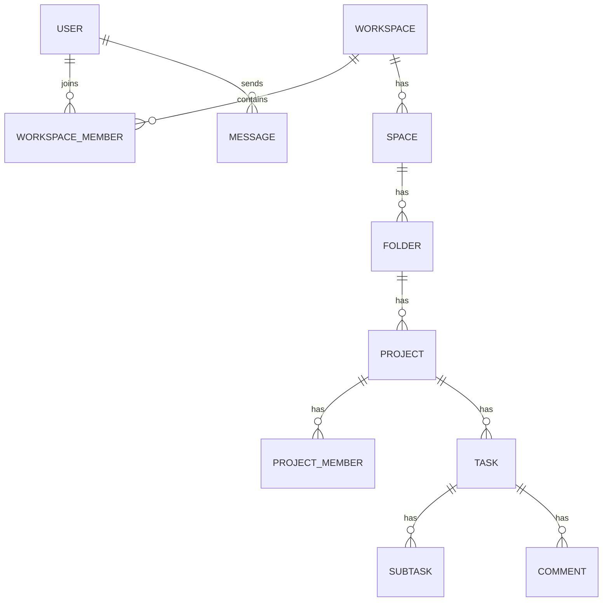

<div align="center">


# TaskForge

### Enterprise-grade project management, team collaboration, and real-time work orchestration platform


<br />

<a href="[REPOSITORY_URL]">
  
</a>
<a href="[REPOSITORY_URL]/blob/main/LICENSE">
  
</a>
<a href="[REPOSITORY_URL]/releases">
  
</a>

<br />


</div>

---

## ✨ 1. Hero Section

<div align="center">

### Build faster, collaborate smarter, deliver with confidence

<p>
TaskForge is a full-stack collaboration platform designed for distributed teams that need
<strong>clear ownership</strong>, <strong>real-time communication</strong>, and <strong>operational visibility</strong>
across projects and tasks.
</p>

<p>
<a href="[LIVE_URL]">
  
</a>
<a href="#-8-installation-guide">
  
</a>
<a href="[REPOSITORY_URL]">
  
</a>
</p>

</div>

---

## 🧭 2. Project Overview

### What is TaskForge?
TaskForge is a web-based SaaS collaboration system that unifies planning, execution, and communication into one platform. It combines hierarchical project modeling with real-time chat and high-performance APIs.

### Why this project exists
Most teams juggle multiple tools for tasks, updates, communication, and access control. TaskForge reduces fragmentation by centralizing workflows in a secure, scalable workspace model.

### Main purpose
- Streamline task lifecycle management from planning to delivery.
- Enable transparent collaboration across company workspaces.
- Provide real-time communication in context of work.

### Business value
- Faster project execution with less context switching.
- Strong governance via RBAC and company-level boundaries.
- Better accountability through structured hierarchy and event-based updates.

### Target users
- Startup teams and SMBs managing multi-project execution.
- Operations and delivery teams requiring role-based control.
- Engineering, product, and support units collaborating in real time.

---

## 🖼️ 3. Project Preview

<div align="center">

<!-- Replace the following image URLs with your actual screenshots/GIFs -->

| Dashboard | Kanban / Tasks | Realtime Chat |
|---|---|---|
|  |  |  |

### Demo GIF


<br />

<a href="[LIVE_URL]">
  
</a>
<a href="[REPOSITORY_URL]/wiki">
  
</a>
<a href="[REPOSITORY_URL]">
  
</a>

</div>

---

## 🌟 4. Key Features

<div align="center">

| Category | Feature | Value |
|---|---|---|
| 🏢 Workspace Governance | Company-bound multi-tenant workspaces | Strong data boundaries and ownership isolation |
| 👥 Access Control | Owner/Admin/Member/Viewer role model | Secure collaboration with predictable permissions |
| 🧱 Project Hierarchy | Workspace → Space → Folder → Project | Scalable organization for complex delivery structures |
| ✅ Task Engine | Tasks, subtasks, comments, categories, due dates | Operational clarity and execution speed |
| 💬 Realtime Collaboration | Socket.IO chat rooms, invitation signals, project sync events | Immediate updates and reduced communication lag |
| 🔐 Security | JWT, OTP verification, password validation, throttling | Production-grade identity and abuse protection |
| ⚡ Performance | Redis caching, Mongo indexes, selective query fields | Faster read paths and improved API responsiveness |
| 📧 Workflow Automation | Async email delivery + background reminders/cleanup | Non-blocking operations and better reliability |
| 📊 Insights | Task statistics and workload visibility endpoints | Better planning and prioritization |

</div>

---

## 🏗️ 5. Architecture Overview

### System architecture



### Folder-level architecture
- `frontend` serves the SPA and interaction layer.
- `backend` owns domain logic, APIs, auth, validation, and persistence orchestration.
- `socket-server` handles low-latency event channels for chat and real-time state updates.

### Application flow
1. User authenticates via JWT-backed auth endpoints.
2. Frontend consumes REST resources for CRUD and dashboard data.
3. Socket server validates token, joins scoped rooms, and emits collaboration events.
4. Worker process handles deferred workflows (emails, reminders, scheduled cleanup).

### Database flow
- Primary data model resides in MongoDB via MongoEngine documents.
- Django default database is retained for framework-level migration machinery requirements.
- Redis accelerates frequently accessed responses and transient state.

### API flow
- Request enters middleware and DRF auth/permission layers.
- View-level validation and business rules execute.
- Data layer reads/writes through document models.
- Standardized JSON response returns to client.

---

## 🧰 6. Technology Stack

<div align="center">

### Frontend Technologies


### Backend Technologies


### Database Technologies


### Authentication


### Cloud Services


<!-- Replace the badge above with your primary cloud/provider badge if needed -->

### DevOps Tools


### Testing Tools


### AI/ML Tools


### Deployment Platforms


</div>

---

## 📁 7. Project Structure

```text
project/
├── frontend/            # React SPA, routing, state stores, UI components
├── backend/             # Django API, domain logic, RBAC, auth, background commands
├── database/            # (recommended) migrations, seeds, data docs, ER assets
├── docs/                # (recommended) architecture docs, API specs, runbooks
├── tests/               # (recommended) unit, integration, e2e suites
├── scripts/             # utility scripts, CI helpers, automation tasks
├── public/              # static public assets for frontend
└── configuration/       # environment templates, deployment manifests, infra config
```

### Current repository mapping

```text
TaskForge/
├── backend/
│   ├── apps/
│   │   ├── chat/
│   │   ├── companies/
│   │   ├── core/
│   │   ├── projects/
│   │   ├── tasks/
│   │   ├── users/
│   │   └── workspaces/
│   ├── config/
│   ├── templates/
│   └── media/
├── frontend/
│   ├── src/
│   │   ├── api/
│   │   ├── components/
│   │   ├── pages/
│   │   ├── store/
│   │   └── utils/
│   └── public/
├── socket-server/
├── render.yaml
└── README.md
```

---

## ⚙️ 8. Installation Guide

### Prerequisites
- Python 3.11+
- Node.js 20+
- npm 10+
- MongoDB Atlas or local MongoDB
- Redis (recommended for production-grade caching)

### 1) Clone repository
```bash
git clone [REPOSITORY_URL]
cd TaskForge
```

### 2) Backend setup
```bash
cd backend
python -m venv .venv
# Windows
.venv\Scripts\activate
# macOS/Linux
# source .venv/bin/activate
pip install -r requirements.txt
```

### 3) Frontend setup
```bash
cd ../frontend
npm install
```

### 4) Socket server setup
```bash
cd ../socket-server
npm install
```

### 5) Environment setup
Create `.env` files in:
- `backend/.env`
- `frontend/.env`
- `socket-server/.env`

Use the table in Section 9 as your source of truth.

### 6) Database setup
```bash
cd ../backend
python manage.py ensure_mongo_indexes
```

### 7) Run development servers
```bash
# Terminal A - Backend
cd backend
python manage.py runserver
```

```bash
# Terminal B - Socket server
cd socket-server
npm run dev
```

```bash
# Terminal C - Frontend
cd frontend
npm run dev
```

### 8) Build production version
```bash
cd frontend
npm run build
```

```bash
cd ../backend
python manage.py collectstatic --no-input
```

### 9) Deployment instructions (quick)
- Render: use `render.yaml` as baseline blueprint.
- Vercel: frontend SPA rewrites are preconfigured in `frontend/vercel.json`.

---

## 🔐 9. Environment Variables

| Variable | Description | Required |
|---|---|---|
| `SECRET_KEY` | Django secret key | Yes |
| `DEBUG` | Debug mode (`True/False`) | Yes |
| `JWT_SECRET` | JWT signing secret (overrides fallback) | Recommended |
| `MONGO_URI` | MongoDB connection string | Yes |
| `MONGO_DB_NAME` | Mongo database name | Yes |
| `ALLOWED_HOSTS` | Django allowed hosts list | Yes (prod) |
| `CORS_ALLOWED_ORIGINS` | Allowed CORS origins | Yes |
| `REDIS_URL` | Redis cache URL | Recommended |
| `BREVO_API_KEY` | Brevo API key for email | Yes (email features) |
| `DEFAULT_FROM_EMAIL` | Sender email address | Yes |
| `DEFAULT_FROM_NAME` | Sender display name | Yes |
| `FRONTEND_URL` | Deployed frontend URL for email links | Yes (prod) |
| `SECURE_SSL_REDIRECT` | Force HTTPS in production | Recommended |
| `VITE_API_URL` | Frontend base API URL | Yes |
| `VITE_SOCKET_URL` | Frontend Socket.IO server URL | Yes |
| `PORT` | Socket server port | Yes (hosted) |
| `CORS_ORIGIN` | Socket allowed origins (comma-separated) | Yes |

<!-- Replace/add env vars according to your hosting provider and secrets manager -->

---

## 📡 10. API Documentation

Base URL examples:
- Local API: `http://localhost:8000/api`
- Production API: `https://your-api-domain/api`

### Authentication endpoints
- `POST /api/auth/register/`
- `POST /api/auth/register/verify/`
- `POST /api/auth/register/resend-otp/`
- `POST /api/auth/forgot-password/`
- `POST /api/auth/forgot-password/reset/`
- `POST /api/auth/login/`
- `POST /api/auth/refresh/`
- `POST /api/auth/logout/`
- `GET /api/auth/me/`
- `DELETE /api/auth/me/delete/`
- `POST /api/auth/recover/`
- `GET /api/auth/recover-token/`
- `POST /api/auth/change-password/`
- `GET /api/auth/me/export/`
- `GET /api/auth/users/`

### User endpoints
- `GET /api/auth/me/`
- `PATCH /api/auth/me/`
- `POST /api/auth/change-password/`
- `GET /api/auth/users/`

### Admin endpoints
This project uses role-protected domain endpoints rather than a dedicated `/api/admin` REST namespace.

Admin-capable examples:
- `POST /api/workspaces/<workspace_id>/members/add/`
- `PATCH /api/workspaces/<workspace_id>/members/<user_id>/role/`
- `POST /api/projects/<project_id>/members/add/`

### Resource endpoints
- Workspaces: `/api/workspaces/*`
- Projects hierarchy: `/api/projects/*`
- Tasks/subtasks/comments: `/api/tasks/*`
- Categories: `/api/categories/*`
- Chat context/messages/upload: `/api/chat/*`
- Company checks: `/api/companies/check/`

### Response example (success)
```json
{
  "message": "Operation completed successfully",
  "data": {
    "id": "2fa0f6de-0c0a-4e0d-a2ca-5f30f2394dd2"
  }
}
```

### Error handling example
```json
{
  "error": "Invalid or expired reset link."
}
```

Recommended status handling:
- `200/201` success
- `400` validation/client input issue
- `401` unauthenticated
- `403` unauthorized
- `404` not found
- `410` resource recovery window expired
- `429` rate limit exceeded
- `500` unexpected server error

---

## 🗄️ 11. Database Design

### ER diagram (logical)



### Core collections/tables (document model)
- Users
- Workspaces
- WorkspaceMembers
- Spaces
- Folders
- Projects
- ProjectMembers
- Tasks
- SubTasks
- Comments
- Messages

### Relationships
- Company-based segmentation constrains cross-tenant access.
- Membership collections enforce role-aware authorization.
- Task entities connect upward to project hierarchy for context.

### Indexing strategy
- Unique index on user email.
- Membership indexes on `workspaceId`, `projectId`, `userId`.
- Query-friendly indexes for task status, due dates, and assignee filters.
- Additional index bootstrapping via management commands.

### Optimization notes
- Use projected fields (`only(...)`) on list endpoints.
- Cache high-read responses and metadata in Redis.
- Keep payloads small with pagination and selective serialization.

---

## 🛡️ 12. Security Features

- ✅ Authentication: JWT access/refresh token flow.
- ✅ Authorization: role-based permissions by workspace/project membership.
- ✅ JWT security: token verification across API and Socket.IO connection handshake.
- ✅ Rate limiting: DRF throttles and endpoint-level ratelimits.
- ✅ Input validation: serializer validation + password validators.
- ✅ SQL/NoSQL injection mitigation: ORM/document abstraction and strict query handling.
- ✅ XSS protection: framework defaults and output-encoding patterns.
- ✅ CSRF protection: Django middleware for state-changing operations.
- ✅ Secure headers: HSTS, content-type nosniff, secure cookie settings in production mode.

---

## 🚀 13. Advanced Features

- Realtime updates via Socket.IO room broadcasts.
- Invitation notifications and role update events.
- Multi-role management with admin/member/viewer boundaries.
- Account deletion lifecycle and timed recovery windows.
- Activity tracking through structured task and message events.
- Task statistics endpoints for analytics dashboards.
- Data export endpoint for user-owned account data.
- Async email automation (invites, reminders, recovery).
- AI features: integration-ready architecture for assistant workflows and smart automations.
- Automation workflows through background worker command loops.

---

## ⚡ 14. Performance Optimizations

- Redis caching with in-memory fallback.
- Query projection and pagination defaults.
- Index-first access patterns for high-cardinality collections.
- Optimized task and member retrieval with constrained filtering.
- Static asset compression via WhiteNoise.
- Frontend code-splitting and Vite build optimization.
- Compression/CDN support via deployment platform edge capabilities.
- Health checks and operational visibility for runtime monitoring.

---

## 🧪 15. Testing

Recommended test strategy:

### Unit testing
- Backend serializers, permission classes, utility functions.
- Frontend stores, hooks, and utility modules.

### Integration testing
- Auth + workspace/project/task API flows.
- Worker-driven email and deletion lifecycle behaviors.

### API testing
- Contract tests per endpoint group with auth scenarios.
- Rate-limit and validation boundary checks.

### End-to-end testing
- Critical flows: onboarding, task lifecycle, invitation acceptance, chat.
- Suggested tooling: Playwright + seeded test data.

<!-- Add direct test commands once CI test scripts are finalized -->

---

## ☁️ 16. Deployment

### Docker
- Containerize `backend`, `frontend`, and `socket-server` as separate services.
- Add managed Redis + MongoDB or external cloud providers.

### Vercel
- Deploy frontend as SPA (`frontend/vercel.json` rewrite is ready).

### Netlify
- Deploy frontend build output with SPA redirect rules.

### DigitalOcean
- Use App Platform or Droplets with reverse proxy and managed DB/cache.

### Railway
- Deploy backend and socket services with environment variable injection.

### Render (current blueprint)
- `render.yaml` defines backend web, socket web, and worker process.

---

## 🗺️ 17. Roadmap

### Completed features
- [x] JWT authentication and refresh flow
- [x] OTP-based registration verification
- [x] Company-scoped workspace/project/task system
- [x] Real-time chat and invitation event pipeline
- [x] Async email and background reminder worker
- [x] Task statistics and dashboard-oriented APIs

### Upcoming features
- [ ] Full automated test suite with CI pipelines
- [ ] Comprehensive API reference site (OpenAPI/Swagger)
- [ ] Notification preferences and digest scheduling
- [ ] Fine-grained audit timeline views

### Future enhancements
- [ ] AI-assisted task prioritization and drafting
- [ ] Advanced reporting and export packs
- [ ] SLA/incident workflow modules
- [ ] Multi-region deployment templates

---

## 🤝 18. Contributing Guide

We welcome high-quality contributions.

1. Fork the repository.
2. Create your feature branch: `git checkout -b feature/amazing-improvement`
3. Commit with clear messages: `git commit -m "feat: add amazing improvement"`
4. Push to your fork: `git push origin feature/amazing-improvement`
5. Open a Pull Request with context, screenshots, and test notes.

Contribution standards:
- Keep PRs focused and reviewable.
- Add/update tests where relevant.
- Preserve code style and architecture conventions.

---

## 📄 19. License

This project is licensed under the MIT License.

See the [LICENSE](LICENSE) file for full details.

---

## 👤 20. Author Section

<div align="center">

### [AUTHOR_NAME]

<a href="https://github.com/[GITHUB_USERNAME]">
  
</a>
<a href="[PORTFOLIO_URL]">
  
</a>
<a href="[LINKEDIN_URL]">
  
</a>
<a href="mailto:[EMAIL_ADDRESS]">
  
</a>

</div>

<!-- Replace [PORTFOLIO_URL], [LINKEDIN_URL], [EMAIL_ADDRESS] with your actual links -->

---

## 📈 21. GitHub Statistics

<div align="center">


<!-- Contribution snake (enable with GitHub Actions in your profile/repo) -->


</div>

---

## 🎯 22. Footer

<div align="center">

### Built with precision, performance, and production discipline.

<p>
If this project helps your team, please consider starring the repository and sharing feedback.
</p>


</div>
